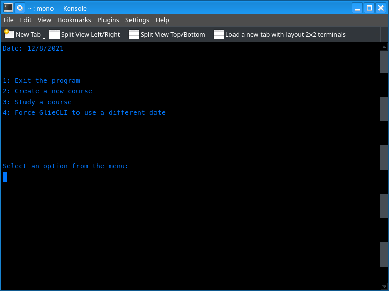
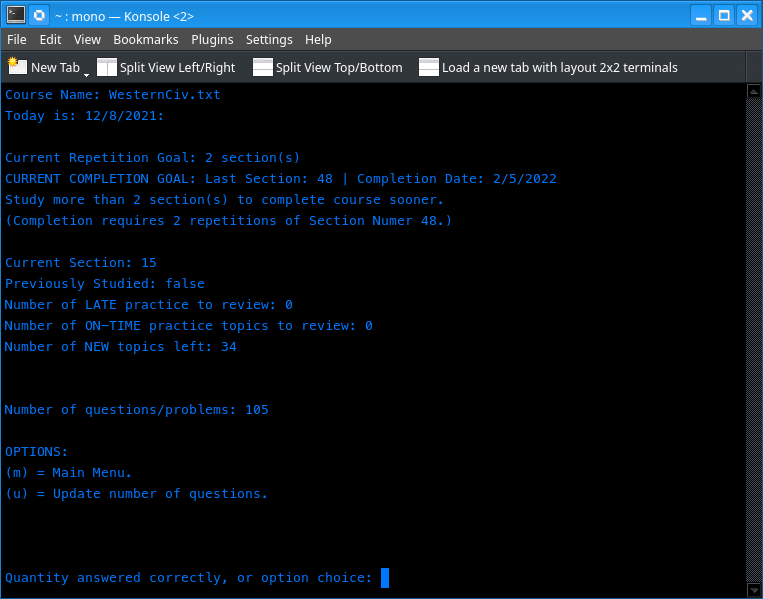
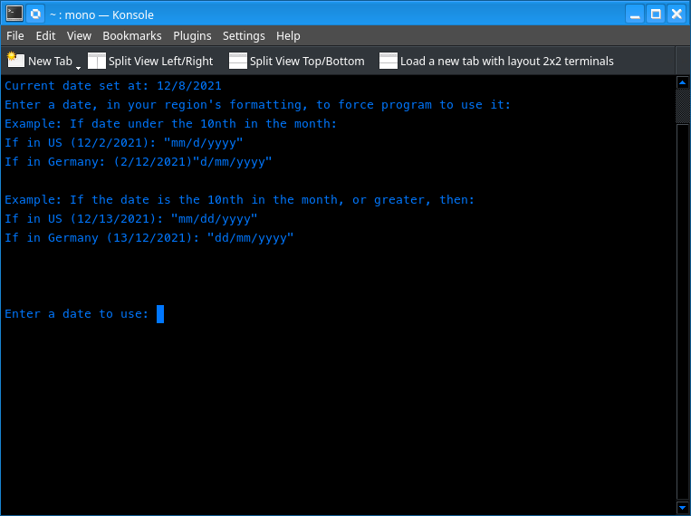

# Update Dec 3rd 2021: Date Reinforcment - Win earlier completion dates!

I thought it would be more reinforcing to see how many repetitions I need to complete the predicted date. Then I thought it would be cool to see if I could win an earlier completion date! 

# About
Glide allows people who use it to study more efficiently, and learn at a very fast rate. 

# GlideCLI now does these things:
* display number of topics left
* allows user to switch topics
* exit from menu
* Change number of total questions on first study of a topic
* Predicts the date a course will be completed by.
* Allows users to win earlier completion dates.
* Now allows user to change the current date back to the previous, in case the study session starts after midnight. I also use this for debugging.

GlideCLI is a command line interface application:
(You might need to modify the size of your command line window to see everything in the Study HUD, until the graphical user-interface version is ready.)

## Screenshots

Main Menu

The Study HUD

New Date changing feature

# To Install:
GlideCLI MIGHT run on MacOS now. It WILL now run on Windows, Linux, and Docker:
(I don't have a mac, but if someone with a mac wants to try it, please tell me if it works. I am only guessing that macOS uses a Unix directory structure.)

* Step 1:
Just download Mono here for your operating system:
https://www.mono-project.com/download/stable/#download-lin

* Step 2:
Download GlideCLI from the release page here:
https://github.com/Dartomic/GlideCLI/releases/download/v0.21-alpha/GlideCLI.exe

* Step 3:
Then open a command prompt in the directory that GlideCLI.exe is in, and type
mono GlideCLI.exe

# Making a course for GlideCLI:
Making a course for GlideCLI is tedious. The two programs that are going to replace GlideCLI will be far easier to add a course in. Although the user interface looks different, since it displays a lot more information now, the instructions for adding a course are the same as before this update. The instructions are in this manual I made, which I will update at a later time to be more like a regular manual. 

Here is the link: https://github.com/Dartomic/GlideCLI/blob/master/Docs/Manual.pdf

# Difference between this software, and the research
The research currently used by most scientists for the calculation of difficulty, which is used to calculate the interval length between study sessions, it is also used in the calculation of engram stability, and it is also used in the calculation of the forgetting curve, is inaccurate. The research I am referring to, for this currently accepted calculation of difficulty can be found here: https://github.com/Dartomic/GlideCLI/blob/master/Docs/easinessFactor.pdf

I explain how the currently accepted calculation is innaccurate in the document: https://github.com/Dartomic/GlideCLI/blob/master/Docs/Differences.md

If you look at the pdf file that I linked in the about section (https://github.com/Dartomic/GlideCLI/blob/master/Docs/Manual.pdf), I go into detail to explain how the calculation of difficulty is performed in this software.

Since I realized that I am not using anyone elses research for the calculation of difficulty, and since the researchers gave a name to their calculation of difficulty in the journal article I linked to (which I mentioned is not accurate, and is therefore not used in my program), then maybe I should name the calculation of difficulty in GlideCLI. It does not exactly feel right to do this, because I am just using the Slope-Intercept formula. But I decided to give it a name anyway, to distinguish this way of calculating difficulty from the way that it is calculated by the researchers who have PhD's. I'm naming it Spacing Multiplyer. 

The name Spacing Multiplier is not mentioned in the source code yet, because after I have been using it for three years, I just realized that I should name it. This way I don't have to mention the other formula for the calculation in order to explain how difficulty is calculated in anything I write in the future.

# The Forgetting Curve
GlideCLI does calculate the forgetting curve, and uses the formula from this research:

https://github.com/Dartomic/GlideCLI/blob/master/Docs/5535.pdf

Other than calculating the forgetting curve, and storing the result in a file, this calculation, and the result that it produces, is not actually used for anything yet. It has only been in the program the entire time so that the results will be available for a graph that the users can view, after I write the part that draws the decay curve for the user by using this calculation. The result might be called Engram Stability. I mentioned this value earlier in this Readme document a long time ago, in a way that makes me think Engram Stability might be a separate calculation. I can't remember until I go look at it again later.

The most important part of the program is actually the formula that calculates difficulty, which I named "Spacing Multiplier" just now. For this software, this is what the user is dependent on in order to have the repetitions available when they should be performed again. The source code will reflect this new name pretty soon.

So, other than just being a cool feature in a future iteration of the design of this software, if I were to continue to use the formula that the researchers made, it contributes nothing that this software, or any derivitive that I write of it, will ever need to use, except for a neat entertainment novelty. If it turns out that the formula(s) for engram stability and the forgetting curve, that I am currently using from the research article, is somehow owned by any of those researchers, or the institute that funded that research, then somebody just let me know by issuing a bug report, please. I will immediately remove it. Like I said, it contributes nothing to the funtionality of this software. Removing it would make no difference for anyone currently using this software. I will have the program write zeros in place of those values until I write the replacement.

But I just now decided that I am going to remove this calculation anyway, partly just in case if it turns out to be an issue. I thought of a different formula that nobody else is using that I can just use for the calculation of Engram stability in its' place. The results it will produce should be at least as good as the current formula, except it's not documented in any research, since the idea of what I can replace it with popped in my head just now. It is a little more complex than the other formula, since it doesn't look like any math formula in my head that I've seen before. Nonetheless, it is a formula.

# After I change the Forgetting Curve Formula This Uses
After I change over to this other formula that no one has used yet for the calculation of Engram Stability, the learning components of my program will be 100% made of algorithms that I designed. It wont be using anyone elses' mathematical formulas made to calculate parts of learning. 

I will do this partly because I think some people I know may believe that I just took some other peoples work and that I am claiming it as my own here. I don't think they would believe this if they would have read every thing here, but I am not really sure... maybe they did read everything. Some people seem to be able to read something and gain some completely different message than what was written. And some people just want to believe that they don't know anybody who did a lot of work to understand something enough in order to use it, when the person who did the work didn't have to be told by someone else to do it. I have used some other peoples work here. I have made that fact very clear in this readme, and the documents I have included with the source code, and have listed their research here, which are what some of the documents consist of. I have done this in order to give them full credit. I don't see how I can be anymore clear that I am not taking anyone else's work, and claiming it as my own. I am not taking credit for anyone else's work. If you click the links to the documents, read them, and you will not see my name included in those research papers, because I am not taking credit for work I did not do.

So that's another reason I will switch to another algorithm in place of what the researchers have made, this time for the calculation of the forgetting curve and engram stability, which is the only part of the software that is using anyone else's work for the learning calculations, and again, it's going to just be more of a novelty for the program. It's only here before I wrote anything that uses it to save me work when I'm ready to draw the decay curve. But some people I know are probably still going to think that I am just using somebody else's work, and pretending that I made this, even after I have only my own original calculations for learning here, once this is the case for 100% of calculations for learning used here. But at least I WILL KNOW, and any researchers who come across this will know, that once I switch to my own forgetting curve and engram stability formulas, which are not even used for anything yet in my software, I will literally not even have any moral obligation to even mention the research articles that have been published for any formula that expresses the calculation of these values, because this will not be using anyone else's formula for those calculations. I don't actually mind using their formulas and giving them credit for it. They're good formulas. I personally don't see the point in re-inventing the wheel just to use it to build a car, but I guess some people don't think a person built their own car, unless they also built the wheels--- which is kind of a bad analogy in this case since this software doesn't even need to perform these calculations in order to get the user from point A to point B. It's not even something the users currently can see, unless they look through the source code. How far would I have to go in order to not be seen as someone who stole someone else's work, and pretended that I invented it? Would I have to reinvent the computer that this software runs on? Would I have to dig out all the silicon this thing uses, with my bare hands? Well I'm not gonna go any further than using the formula that just convieniently popped up in my head, and I wouldn't even go this far if it weren't for the fact that a different and unused formula for them did just pop up in my head.

This is coming kind of soon. I'm not exactly in a hurry to get it set up. While I do care how accurate this new formula is, I don't have time yet to test it's validity using several sets of 13 groups of 3 random syllables that a lot of researchers use to test the formulas. This is due to the nature of the study, because it could take several years. Having said that, the way I picture the formula, which doesn't actually look like something I could see with my physical eye balls, until I write it all out in code, it looks to me like it would be a litle more accurate than the formulas from the published research article. After I write it, if a researcher out there wants to test this hypothesis, then I think that would be really cool. If it turns out it's not accurate, then I'll get rid of that calculation. The program doesn't need that calculation anyway, unless I want to write the part that draws the forgetting curve later. If it turns out to be more accurate, then just name me in your research submission to a journal. You wont need to pay me anything since the only claim I will have to it, is as the guy who wrote it in a GPL liscensed program. I just want to be mentioned if it turns out that I'm correct in regards to this different forgetting curve algorithm.
