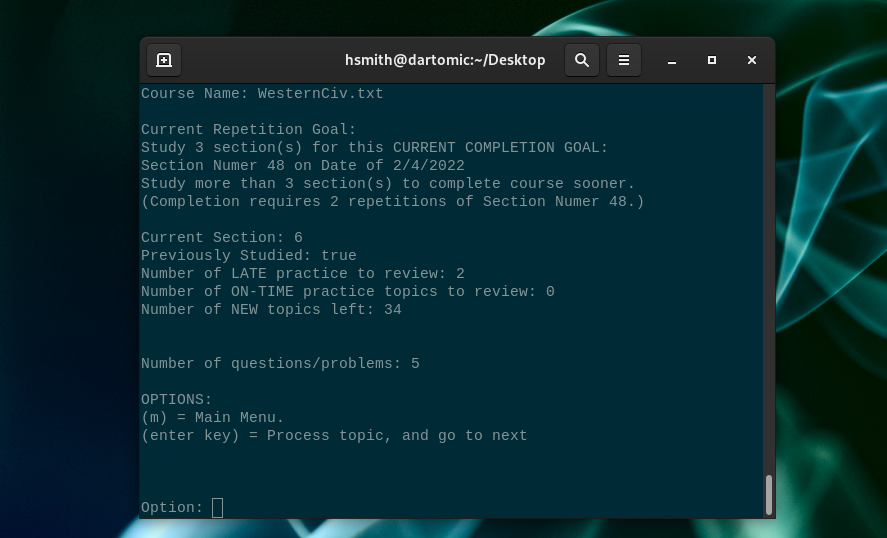

# Update Dec 3rd 2021: Date Reinforcment - Win earlier completion dates!

I thought it would be more reinforcing to see how many repetitions I need to complete the predicted date. Then I thought it would be cool to see if I could win an earlier completion date! 

# About
Glide allows people who use it to study more efficiently, and learn at a very fast rate. 

# GlideCLI now does these things:
* display number of topics left
* allows user to switch topics
* exit from menu
* Change number of total questions on first study of a topic
* Predicts the date a course will be completed by.
* Allows users to win earlier completion dates.

GlideCLI is a command line interface application:

## Screenshot

# To Install:
GlideCLI MIGHT run on MacOS now. It WILL now run on Windows, Linux, and Docker:
(I don't have a mac, but if someone with a mac wants to try it, please tell me if it works. I am only guessing that macOS uses a Unix directory structure.)

* Step 1:
Just download Mono here for your operating system:
https://www.mono-project.com/download/stable/#download-lin

* Step 2:
Download GlideCLI from the release page here:
https://github.com/Dartomic/GlideCLI/releases/download/v0.21-alpha/GlideCLI.exe

* Step 3:
Then open a command prompt in the directory that GlideCLI.exe is in, and type
mono GlideCLI.exe

# Making a course for GlideCLI:
Making a course for GlideCLI is tedious. The two programs that are going to replace GlideCLI will be far easier to add a course in. Although the user interface looks different, since it displays a lot more information now, the instructions for adding a course are the same as before this update. The instructions are in this manual I made, which I will update at a later time to be more like a regular manual. 

Here is the link: https://github.com/Dartomic/GlideCLI/blob/master/Docs/Manual.pdf

# Difference between this software, and the research
The current research for the calculation of difficulty, which is used to calculate the interval length between study sessions, it is also used in the calculation of engram stability, and it is also used in the calculation of the forgetting curve, is inaccurate.The research for the currently accepted calculation of difficulty can be found here: https://github.com/Dartomic/GlideCLI/blob/master/Docs/easinessFactor.pdf

The calculation is inaccurate, because it can produce a result below the value of 1.3, which would cause the interval length between study sessions to be far too short. The way the researchers would go around that, is by setting the veriable to 1.3 if it was calculated as being below 1.3... The problem with this, is that their formula in the Easiness Factor research paper that I linked to, is calculating an innacurate value for everything. Information that was calculated as being a difficulty of 1.3, and was easier to learn than the hardest material, which is calculated as less than 1.3, does not all of a sudden become equally as difficult to maintain as the hardest material, when the hardest material is raised to a value equal to 1.3. 

I had to invent a way to calculate difficulty, because I could not find that research document on the Easiness Factor, until after I had written this program. I knew that the calculation of difficulty had to be constrained between these values inclusively, (1.3, and 2.5), and the image of a sloped line on a graph, intersecting y at 1.3, and x at 0, just popped into my head. So I applied the point slope formula to calculate difficulty, and it works perfect. So perfect, that difficulty does not need to be re-calculated for every repetition. It only needs to be calculated on the first repetition. If you look at the pdf file that I linked in the about section (https://github.com/Dartomic/GlideCLI/blob/master/Docs/Manual.pdf), I go into great detail to explain how difficulty is calculated there. Although, it is very simple. I just wanted to be as detailed as I could be so that it is understood how it is more accurate than the research article's version.

